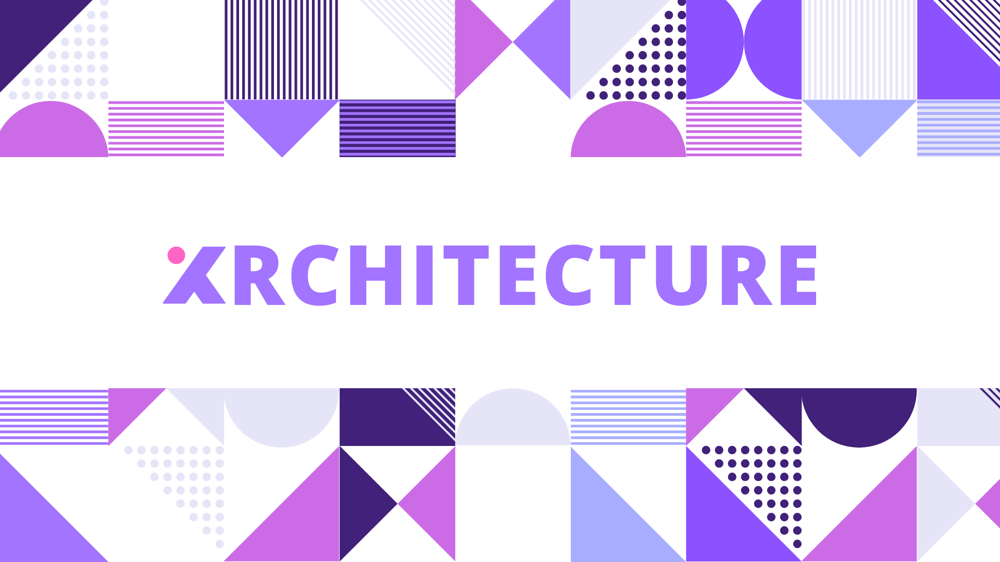
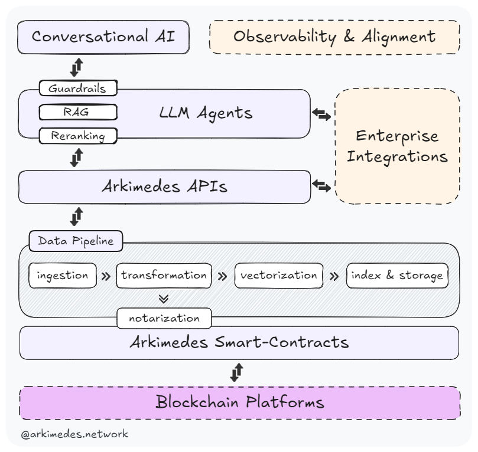
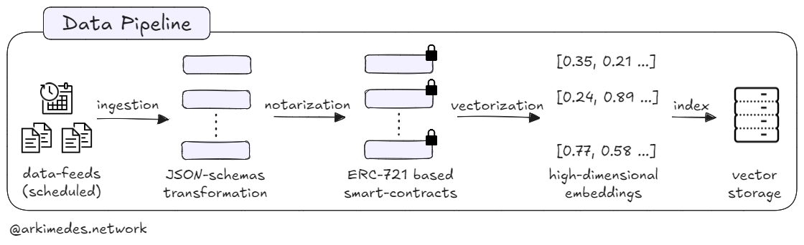
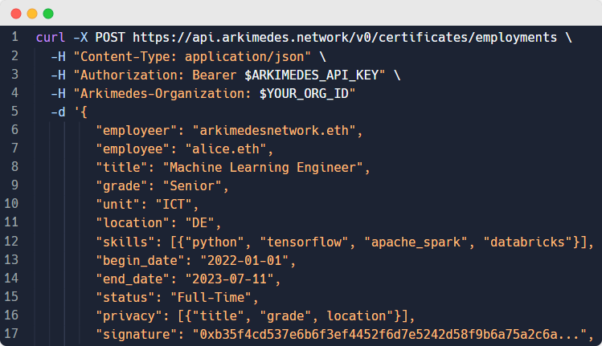
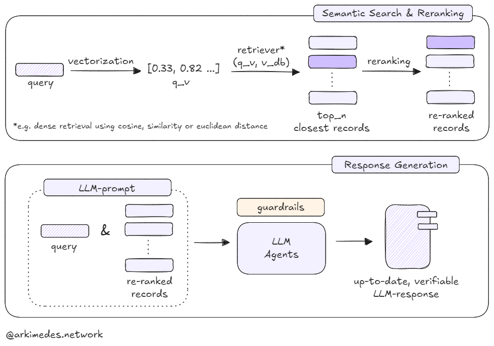
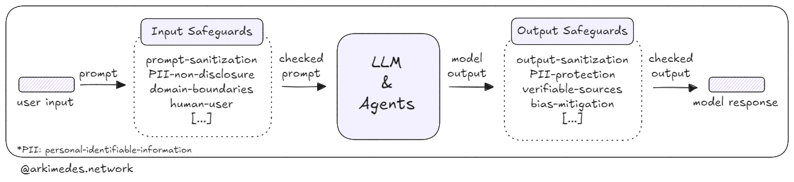
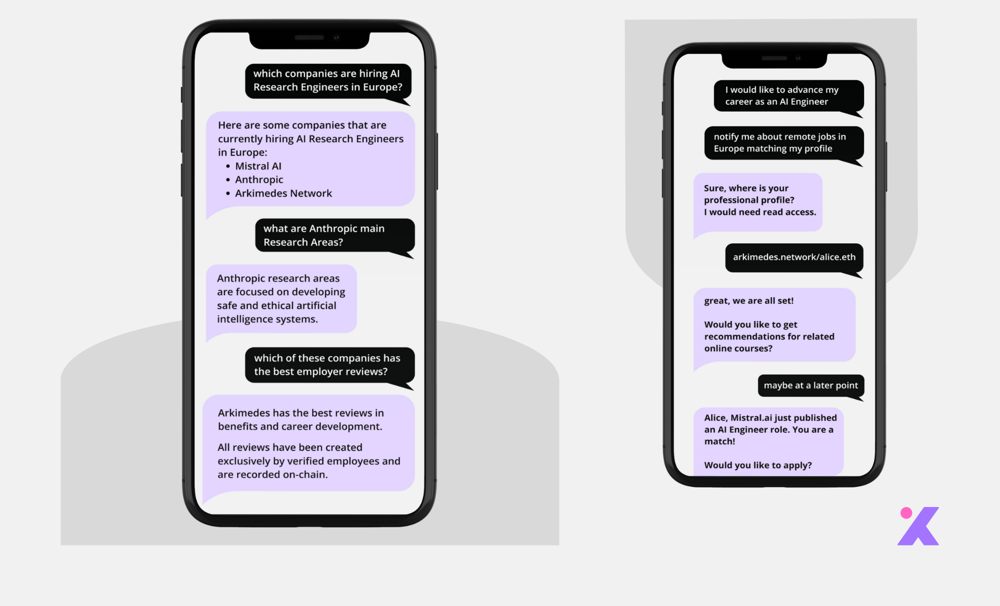

  

# Arkimedes Architecture, at the intersection of AI & Web3

**As Generative AI drives the next digital transformation, conversational interfaces are becoming the preferred choice for users to interact with AI-first applications. This makes the need for trustworthy, verifiable data evident. We, at Arkimedes, believe the intersection of traditional data management with blockchain technology will set a new standard for trust and transparency in AI applications.**

**In this blog article, we share our architecture roadmap to building such a smart, trusted platform that enables both enterprises and individuals to make more confident decisions in hiring and career development.**

  

  Arkimedes Architecture

## Data Pipeline

Arkimedes gathers data from multiple sources, each with its own format. This diversity requires that input data be shaped and enhanced before being made available to users. Our pipeline is based on an adapted Extract, Transform, and Load (ETL) pattern.

  

  Arkimedes Data Pipeline

### Ingestion & JSON-Schema Transformation

The process begins with a scheduled job that ingests records from various input sources. It then continues with the transformation task where the data is filtered, validated, and converted into common, pre-defined JSON schemas.

### Notarizing Data On-Chain with Smart Contracts

To help both enterprises and individuals make confident decisions in hiring and career development while mitigating the risk of scams, our smart contracts (based on the ERC-721 standard) enable each data point, such as job listings, reviews, academic credentials, and professional experience, to be notarized on-chain as a non-transferable, digitally-signed certificate. State-of-the-art encryption can be applied at field level. This ensures that users can maintain ownership and privacy of their data while keeping it secure and tamper-proof.

With this on-chain tokenization process, we aimed at enhancing the integrity of the data used by our platform and enabling secure interoperability and composability with Web3 and AI-based systems. Users can trust that the information they access through Arkimedes is authentic and has verifiable provenance.

### Vectorization into High-Dimensional Embeddings

One of the goals of Arkimedes is to simplify the tedious application processes that candidates encounter. This starts with the discovery of career opportunities aligned with users' backgrounds and aspirations. At its core, this process requires a retrieval engine that goes beyond legacy keyword-based search. This is a natural task for embeddings, as they capture semantic understanding in a corpus.

Embeddings are numerical representations of data (such as text) in a high-dimensional space (e.g., 512, 768, and 1024 dimensions). In the context of Arkimedes, embeddings allow us to represent descriptive fields in job listings, reviews, academic credentials, professional experience, and other relevant information as dense vectors. These vectors capture the semantic meaning and relationships between different pieces of data, enabling more nuanced and context-aware matching and retrieval.

For example, an embedding might represent job opening requirements, company culture, or perks in a way that allows for similarity comparisons with candidates’ backgrounds and preferences, even when exact keyword matches are not present.

### Index & Vector Storage

After generating embeddings, we index and store them in a specialized vector database. This step underpins efficient retrieval and semantic searches, as vector databases are optimized for storing and querying high-dimensional vectors.

## Arkimedes APIs

The goal of our APIs is two-fold: to provide secure mechanisms for issuing and verifying information, and to enable efficient retrieval of trustworthy data. These APIs serve as an interface for the Arkimedes ecosystem, making it easy for authorized partners to notarize data on-chain. For data retrieval, the APIs leverage the capabilities of semantic search, enabling to query our vector database using natural language.

  

  Arkimedes API: Credential Endpoint

## Large Language Model & Agents

Arkimedes follows a modular agentic approach, where specialized AI components work together to support enterprises and users in recruitment and career-development related tasks. This design optimizes performance, facilitates integration with external tools, and improves extensibility and explainability in AI-based interactions.

### Retrieval Augmented Generation (RAG)

As a knowledge assistant, Arkimedes implements semantic search and RAG to dynamically incorporate relevant, trustworthy data into model responses. Semantic search is implemented with embeddings, as outlined above; this gives the system the capability to comprehend the meaning behind users' queries. RAG then grounds the language model in verifiable sources, improving accuracy and minimizing hallucinations in its responses.

  

  Arkimedes Retrieval Augmented Generation

### Reranking

This RAG-associated step enhances the quality of the context provided to the language model. In practice, it reorganizes the initial results from the search retrieval based on their relevance to the user's query and optional enterprise-custom scores.

### I/O Guardrails

Guardrails serve as safeguards to ensure our system operates within ethical, compliance, and practical boundaries. At Arkimedes, these mechanisms are designed to monitor, evaluate, and control the interactions and outputs of models and agents.

In practice, our safeguards are based on a set of recommended and fine-tuned policies such as ensuring user consent and verifying that model responses come from on-chain verifiable sources, among others. This is a flexible and dynamic layer that we aim to improve in line with developments in the state-of-the-art to maintain on-topic conversations while mitigating risks such as the generation of unintended content and misuse.

  

  Arkimedes I/O Guardrails

## Conversational AI, Observability & Alignment

We favor interaction in natural language through a conversational interface, integrated with an observability layer. The latter tracks execution paths, monitors the performance of agents in real-time, and gathers user feedback. With this approach, we can identify areas for improvement and ensure the system aligns effectively with user needs.

  

  Arkimedes Conversational AI

